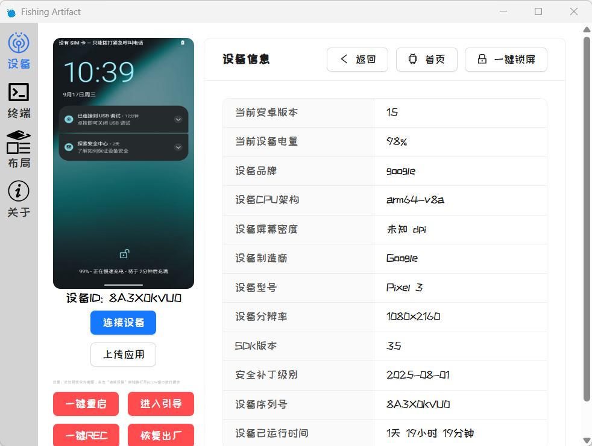
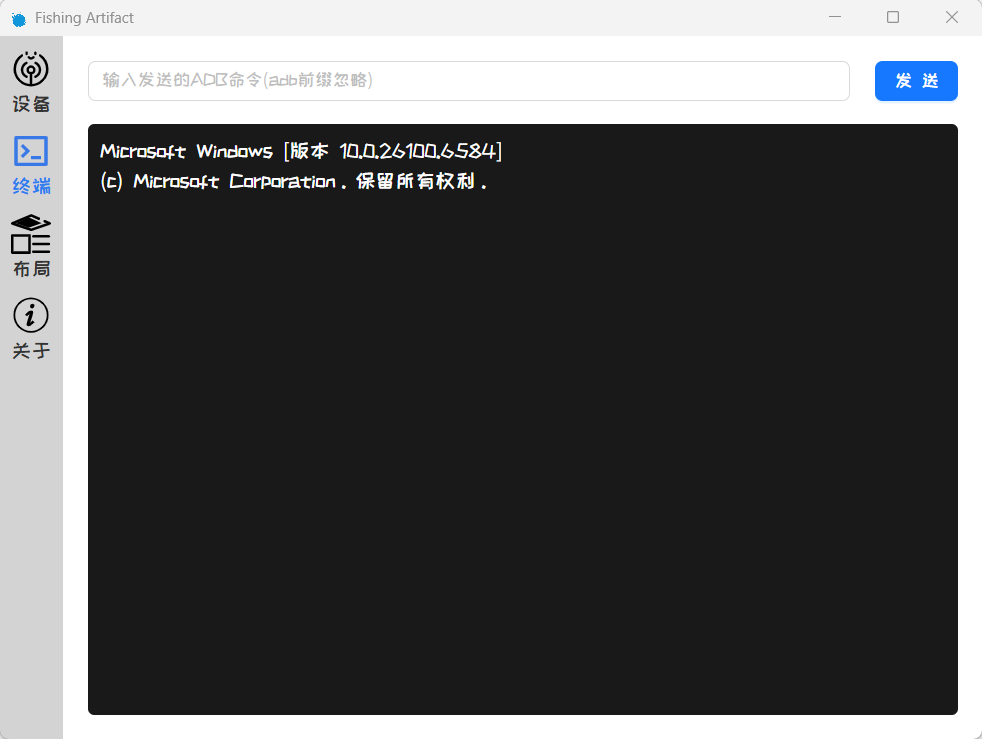
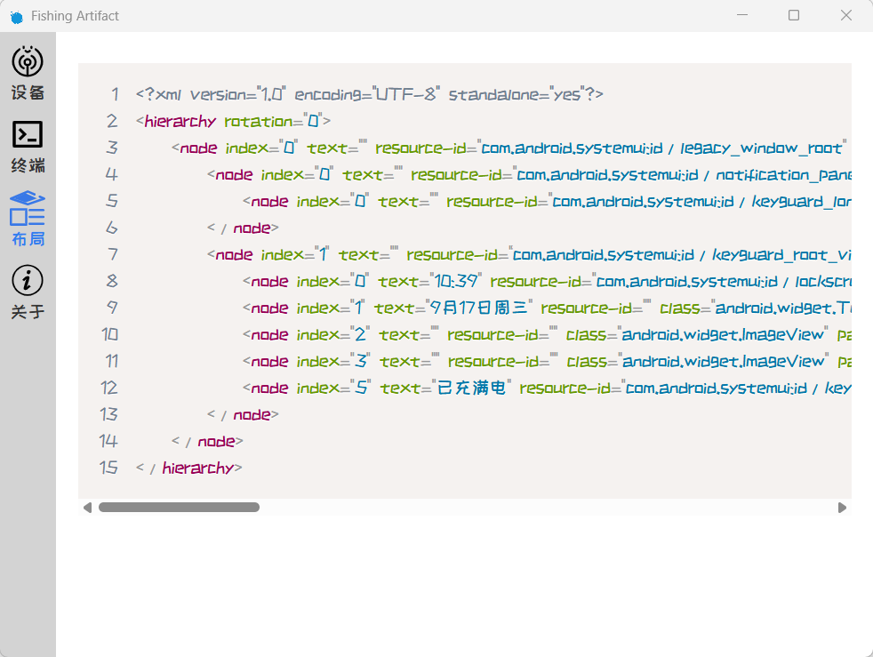
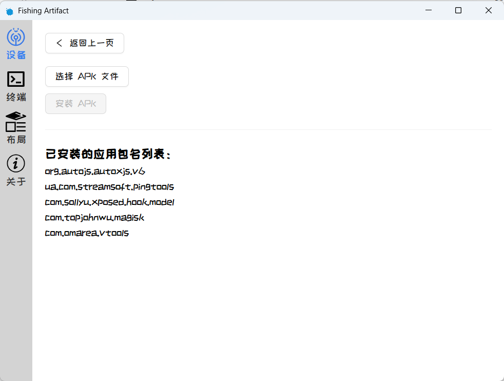

# FishingArtifact


> 有没有一种时候，感觉工作很累了，想玩会手机休息一下？又怕老板发现自己
>
> 没关系，我也有时想偷懒下🧐，于是用摸鱼的时间，做了个可以把自己安卓设备投影到自己的Windows或者是Mac又或者是Linux。现在，就在你的电脑上操作你的手机吧！
>
> 以上，摸鱼有理
>
> *用到了scrcpy等一系列开源项目，感谢在本项目中使用到的所有开源项目的开发者🙏*

## 项目技术栈

**前端**：React+Scss+Typescript

**跨端支持**：Electron

> Q：为什么要用Electron？A：有时间再原生实现好了

项目开源，任何人都可以使用修改分发

## Build相关

```bash
npm run dist
```

就可以直接打包了

- 设备详情与操作

  

- ADB终端

  

- 布局树获取

  

- 上传安装应用

  

## 使用须知

> 需要手机开启开发者模式并且开启USB调试

